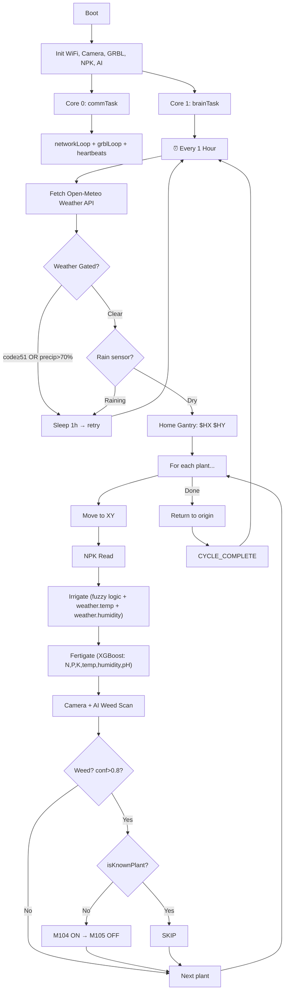

# AGRI-3D Autonomous Gantry — Agent Manager System Prompt

> **Purpose**: Complete specification for an AI Agent Manager to generate the C++ firmware for the AGRI-3D ESP32-S3 autonomous farming gantry. The entire autonomous pipeline runs on **Core 1** and is driven by an **hourly Open-Meteo weather fetch** — the weather reading is the heartbeat that triggers every downstream action: irrigation, fertigation, and weed detection.

---

## 1. SYSTEM OVERVIEW

**AGRI-3D** is an autonomous 3-axis CNC farming gantry with two MCUs:

| Role | MCU | Responsibilities |
|------|-----|-----------------|
| **Master** | ESP32-S3 (N16R8, 16MB Flash, 8MB PSRAM) | WiFi, WebSocket, AI inference, sensor polling, **autonomous hourly routine** |
| **Slave** | Arduino Nano (custom GRBL fork) | Stepper motors (TMC2209), relay actuation (water/fert/weeder), homing |

### Serial Protocol (ESP32 → Nano)
- UART 115200 baud, pins TX=43 RX=44
- ESP32 sends G-code/M-code strings terminated with `\n`
- Nano replies: `ok`, `error:N`, `ALARM:N`, or status `<State|MPos:X,Y,Z|FS:F,S|TMC:a,b,c,d>`
- Real-time bypass: `?` (status), `!` (feed hold), `~` (resume), `0x18` (E-STOP)

### Dual-Core Architecture

| Core | Task | What it does |
|------|------|-------------|
| **Core 0** | `commTask` (priority 3) | `networkLoop()` + `grblLoop()` + `refreshHeartbeats()` — communication only, never blocked |
| **Core 1** | `brainTask` (priority 2) | **THE BRAIN** — hourly weather fetch → gate check → full farming cycle. ALL autonomous logic lives here |

> **CRITICAL**: Core 0 handles ONLY communication (WiFi, WebSocket, Nano serial parsing). Core 1 handles ALL decision-making: weather API calls, irrigation decisions, fertigation, AI weed detection, and gantry motion sequencing.

---

## 2. THE HOURLY BRAIN LOOP (Core 1)

This is the central design principle. Every **1 hour**, Core 1 wakes up, fetches weather, and decides what to do. The weather data feeds into every downstream subsystem.

### Architecture
```cpp
// Core 1 — The Brain (runs every hour)
void brainTask(void* pvParameters) {
    for (;;) {
        // ── STEP 1: Fetch Weather from Open-Meteo ────────────────────
        WeatherData weather = fetchOpenMeteo(_lat, _lon);
        // Returns: temperature_2m, relative_humidity_2m, weather_code,
        //          precipitation_probability, wind_speed_10m

        // ── STEP 2: Weather Gate Decision ────────────────────────────
        bool gated = (weather.code >= 51 || weather.precipProb > 70);
        updateEnvironmentState(gated);  // Sets ENV_CLEAR or ENV_WEATHER_GATED

        if (gated || isRaining()) {
            AgriLog(TAG_ROUTINE, LEVEL_WARN, "Weather gated — sleeping 1 hour");
            broadcastWeatherEvent(weather, true);
            vTaskDelay(pdMS_TO_TICKS(3600000)); // Sleep 1 hour
            continue;
        }

        broadcastWeatherEvent(weather, false);

        // ── STEP 3: Run Full Farming Cycle ───────────────────────────
        // Weather data is passed INTO irrigation and fertigation
        runFarmingCycle(weather);

        // ── STEP 4: Sleep until next hourly tick ─────────────────────
        vTaskDelay(pdMS_TO_TICKS(3600000)); // 1 hour
    }
}
```

### WeatherData Structure (from Open-Meteo)
```cpp
struct WeatherData {
    float temperature;      // °C (current_weather.temperature_2m)
    float humidity;         // % (current_weather.relative_humidity_2m)
    int   weatherCode;      // WMO code (0=clear, 51+=drizzle/rain)
    int   precipProb;       // % precipitation probability
    float windSpeed;        // km/h (current_weather.wind_speed_10m)
    bool  valid;            // false if API call failed
};
```

### Open-Meteo API Call
```
GET http://api.open-meteo.com/v1/forecast
    ?latitude={lat}&longitude={lon}
    &current=temperature_2m,relative_humidity_2m,weather_code,
             precipitation_probability,wind_speed_10m
    &forecast_days=1
```

> **KEY CHANGE**: Temperature and humidity from Open-Meteo are no longer hardcoded defaults — they flow directly into XGBoost fertigation and fuzzy-logic irrigation as live environmental inputs.

---

## 3. HARDWARE & PIN MAP

### ESP32-S3 Pins
```
GRBL Serial:   TX=43, RX=44
Camera OV5640:  XCLK=15, SIOD=4, SIOC=5, Y2-Y9, VSYNC=6, HREF=7, PCLK=13
NPK RS485:     TX=20, RX=19, DE/RE=21 (UART2, 9600 baud)
Rain Sensor:   GPIO 1 (INPUT_PULLDOWN, active HIGH = rain)
SD Card MMC:   CLK=39, CMD=38, D0=40
```

### Nano Relay M-Codes
```
M100 = Water ON    M101 = Water OFF
M102 = Fert ON     M103 = Fert OFF
M104 = Weeder ON   M105 = Weeder OFF
```

### Hardware Flags
```cpp
#define HW_CAMERA_CONNECTED  true
#define HW_NPK_CONNECTED     false   // Not yet wired
#define HW_RAIN_CONNECTED    false   // Not yet wired
#define HW_SD_CONNECTED      true
#define HW_Z_AXIS_BROKEN     true    // Skip ALL Z moves
```

> **SAFETY**: `HW_Z_AXIS_BROKEN = true` — never generate Z-axis G-code. Wrap in `#if !HW_Z_AXIS_BROKEN`.

---

## 4. STATE MACHINE

```cpp
enum WifiState        { WIFI_DISCONNECTED, WIFI_CONNECTING, WIFI_CONNECTED };
enum FlutterState     { FLUTTER_DISCONNECTED, FLUTTER_CONNECTED };
enum NanoState        { NANO_UNKNOWN, NANO_CONNECTED, NANO_UNRESPONSIVE };
enum GrblState        { GRBL_UNKNOWN, GRBL_IDLE, GRBL_RUN, GRBL_JOG, GRBL_HOME,
                        GRBL_HOLD, GRBL_ALARM, GRBL_CHECK, GRBL_DOOR };
enum OperationState   { OP_IDLE, OP_HOMING, OP_SD_RUNNING, OP_FERTILIZING,
                        OP_SCANNING, OP_AI_WEEDING, OP_RAIN_PAUSED, OP_ALARM_RECOVERY };
enum EnvironmentState { ENV_CLEAR, ENV_RAIN_SENSOR, ENV_WEATHER_GATED, ENV_RAIN_AND_WEATHER };
```

---

## 5. WEATHER GATING

### Gating Logic
Weather is **gated** when:
- WMO `weather_code >= 51` (drizzle/rain/storm), OR
- `precipitation_probability > 70%`

### Combined Environment State
```
Rain sensor HIGH + API gated  → ENV_RAIN_AND_WEATHER
Rain sensor HIGH only         → ENV_RAIN_SENSOR
API gated only                → ENV_WEATHER_GATED
Neither                       → ENV_CLEAR
```

### Rain Response
- Rain starts → send `!` (feed-hold) to Nano → `OP_RAIN_PAUSED`
- Rain clears AND API clear → send `~` (resume) → `OP_IDLE`

### Location (NVS-persisted)
Default: Cebu City (10.3157, 123.8854). Flutter sets via `SET_LOCATION:lat,lon`.

---

## 6. PLANT REGISTRY (NVS)

```cpp
struct PlantPosition {
    float x, y;          // mm from home
    char  name[24];
    float targetN, targetP, targetK;  // 0 = use XGBoost
    bool  active, aiDetected;
};
#define MAX_PLANTS 30
```
NVS namespace `"routine"`, keys `"p00"`–`"p29"` as CSV `"x,y,name,N,P,K"`.

---

## 7. NPK SOIL SENSOR (7-in-1 RS485 Modbus)

```cpp
struct SoilReading {
    float moisture, tempC, ec, ph, n, p, k;  // 7 values
    float x, y;  int gridX, gridY;
    time_t timestamp;  bool valid;
};
```
- Modbus RTU query: `01 03 00 1E 00 03 65 CD`
- On-demand via `npkReadNow()` at each plant stop

---

## 8. IRRIGATION (Weather-Informed Fuzzy Logic)

### How Weather Data Flows In
The hourly Open-Meteo fetch provides **real-time temperature and humidity** that directly influence irrigation decisions:

```cpp
void performIrrigation(const PlantPosition& plant, const SoilReading& soil,
                       const WeatherData& weather) {
    // Fuzzy logic inputs from LIVE weather + soil sensor
    float moisture    = soil.moisture;     // From NPK sensor (%)
    float temperature = weather.temperature; // From Open-Meteo (°C)
    float humidity    = weather.humidity;     // From Open-Meteo (%)

    float waterMl = fuzzyIrrigationDecision(moisture, temperature, humidity);

    if (waterMl > 0) {
        unsigned long duration = (waterMl / _waterFlowRate) * 1000;
        enqueueGrblCommand("M100");  // Water ON
        vTaskDelay(pdMS_TO_TICKS(duration));
        enqueueGrblCommand("M101");  // Water OFF
    }
}
```

### Fuzzy Logic Rules
| IF moisture IS | AND temp IS | AND humidity IS | THEN water IS |
|---------------|-------------|-----------------|---------------|
| Low (<30%)    | High (>30°C)| Low (<50%)      | High (100mL)  |
| Low (<30%)    | Normal      | Normal          | Medium (60mL) |
| Medium (30-60%)| High       | Low             | Medium (50mL) |
| Medium        | Normal      | Normal          | Low (25mL)    |
| High (>60%)   | Any         | Any             | None (0mL)    |

### Flow Rate
- Default: **24.0 mL/s** (NVS key `"w_rate"`)
- Duration = `(ml / flowRate) * 1000` ms

---

## 9. FERTIGATION (XGBoost + Live Weather)

### Model
- XGBoost Regressor → compiled to native C (`xgboost_model.c`, ~14MB)
- Interface: `extern "C" { double score(double * input); }`

### Feature Mapping — NOW USES LIVE WEATHER
```cpp
void performFertigation(const PlantPosition& plant, const SoilReading& soil,
                        const WeatherData& weather) {
    // Features fed to XGBoost: [N, P, K, temperature, humidity, pH]
    double features[6] = {
        (double)soil.n,
        (double)soil.p,
        (double)soil.k,
        (double)weather.temperature,  // ← LIVE from Open-Meteo (was hardcoded 25.0)
        (double)weather.humidity,     // ← LIVE from Open-Meteo (was hardcoded 60.0)
        (double)soil.ph              // From NPK sensor (or 6.5 default if unavailable)
    };

    double fertMl = score(features);

    if (fertMl > 0) {
        unsigned long duration = (fertMl / _fertFlowRate) * 1000;
        enqueueGrblCommand("M102");  // Fert ON
        vTaskDelay(pdMS_TO_TICKS(duration));
        enqueueGrblCommand("M103");  // Fert OFF
    }
}
```

### Fert Flow Rate
- Default: **2.0 mL/s** (NVS key `"f_rate"`)

---

## 10. WEED DETECTION (Edge Impulse FOMO)

- **Model**: FOMO, 96×96 RGB, INT8, 2 classes (`"crop"`, `"weed"`), ~290KB arena in PSRAM
- **Pipeline**: Camera JPEG → decode → downsample 96×96 → `run_classifier()` → `AiResult`

```cpp
struct AiResult {
    bool foundPlant, foundWeed;
    float confidence;
    int xOffset, yOffset;
    int cropCount, weedCount, totalDetections;
    AiDetection detections[10];
};
```

### Weed Actuation (TODO — stubbed)
```
For each weed detection:
  1. Convert FOMO grid → real-world mm offset
  2. SAFETY: if isKnownPlantPosition(wx, wy, 50mm) → SKIP
  3. Move: G0 X{wx} Y{wy} F1000
  4. Actuate: M104 ON → delay → M105 OFF
```

---

## 11. COMPLETE HOURLY FARMING CYCLE

This is the full sequence that runs **every hour on Core 1**, driven by the Open-Meteo fetch:

```
╔══════════════════════════════════════════════════════════════╗
║                HOURLY BRAIN CYCLE (Core 1)                  ║
╠══════════════════════════════════════════════════════════════╣
║                                                              ║
║  ┌─────────────────────────────────────┐                     ║
║  │ STEP 1: FETCH OPEN-METEO WEATHER   │ ← HOURLY TRIGGER   ║
║  │  GET temperature, humidity,         │                     ║
║  │      weather_code, precip_prob      │                     ║
║  └──────────────┬──────────────────────┘                     ║
║                 ▼                                            ║
║  ┌─────────────────────────────────────┐                     ║
║  │ STEP 2: WEATHER GATE CHECK         │                     ║
║  │  code >= 51 OR precip > 70%?       │                     ║
║  │  Rain sensor active?               │                     ║
║  │  → YES: Sleep 1 hour, SKIP cycle   │                     ║
║  │  → NO:  Proceed                    │                     ║
║  └──────────────┬──────────────────────┘                     ║
║                 ▼                                            ║
║  ┌─────────────────────────────────────┐                     ║
║  │ STEP 3: HOME GANTRY               │                     ║
║  │  $HX → wait idle → $HY → wait     │                     ║
║  └──────────────┬──────────────────────┘                     ║
║                 ▼                                            ║
║  ┌─────────────────────────────────────┐                     ║
║  │ STEP 4: FOR EACH PLANT             │ ← Loop 1..N        ║
║  │                                     │                     ║
║  │  4a. Re-check rain sensor           │                     ║
║  │  4b. Move to plant XY              │                     ║
║  │  4c. NPK Read (soil sensor)        │                     ║
║  │  4d. IRRIGATE (fuzzy logic)        │                     ║
║  │      inputs: soil.moisture          │                     ║
║  │              weather.temperature ←──┤── from Step 1      ║
║  │              weather.humidity    ←──┤── from Step 1      ║
║  │  4e. FERTIGATE (XGBoost)           │                     ║
║  │      features: [N,P,K,             │                     ║
║  │        weather.temp,  ←────────────┤── from Step 1      ║
║  │        weather.humidity, ←─────────┤── from Step 1      ║
║  │        soil.pH]                     │                     ║
║  │  4f. Camera capture + AI weed scan │                     ║
║  │  4g. Weed actuation (if detected)  │                     ║
║  │                                     │                     ║
║  └──────────────┬──────────────────────┘                     ║
║                 ▼                                            ║
║  ┌─────────────────────────────────────┐                     ║
║  │ STEP 5: RETURN TO ORIGIN           │                     ║
║  │  G0 X0 Y0 → Broadcast COMPLETE    │                     ║
║  └──────────────┬──────────────────────┘                     ║
║                 ▼                                            ║
║  ┌─────────────────────────────────────┐                     ║
║  │ STEP 6: SLEEP 1 HOUR              │ ← Wait for next     ║
║  └─────────────────────────────────────┘     hourly tick     ║
║                                                              ║
╚══════════════════════════════════════════════════════════════╝
```

### Pseudocode
```cpp
void runFarmingCycle(const WeatherData& weather) {
    if (plantCount == 0) return;
    if (sysState.getOperation() != OP_IDLE) return;

    sysState.setOperation(OP_HOMING);
    enqueueGrblCommand("$HX"); waitForGrblIdle(15000);
    enqueueGrblCommand("$HY"); waitForGrblIdle(15000);

    for (int i = 0; i < MAX_PLANTS; i++) {
        if (!plantRegistry[i].active) continue;
        if (isRaining()) { abort; return; }

        PlantPosition& plant = plantRegistry[i];

        // Move to plant
        G0 X{plant.x} Y{plant.y} F1000 → waitForGrblIdle

        // NPK sensor read
        npkReadNow(); SoilReading soil = latestSoil;

        // Irrigate (weather-informed fuzzy logic)
        performIrrigation(plant, soil, weather);  // ← weather from Step 1

        // Fertigate (XGBoost with live temp/humidity)
        performFertigation(plant, soil, weather); // ← weather from Step 1

        // Weed scan (camera + Edge Impulse)
        camera_fb_t* fb = esp_camera_fb_get();
        if (fb && cfg.doWeedScan) {
            AiResult ai = aiAnalyzeJpeg(fb->buf, fb->len);
            if (ai.foundWeed && ai.confidence > 0.8f)
                performWeedAction(plant.x, plant.y, ai);
            esp_camera_fb_return(fb);
        }
    }

    // Return home
    G0 X0 Y0 F1000 → waitForGrblIdle
    sysState.setOperation(OP_IDLE);
    broadcast CYCLE_COMPLETE
}
```

---

## 12. GRBL COMMAND QUEUE & MOTION

```cpp
void enqueueGrblCommand(const String& cmd);
bool waitForGrblIdle(uint32_t timeoutMs);
```

- Adaptive polling: IDLE=2s, RUN=250ms, HOME=500ms, ALARM=3s
- Nano watchdog: unresponsive after `max(4×poll, 10s)`, homing timeout 90s
- Status: `<Idle|MPos:X,Y,Z|FS:F,S|TMC:0,0,0,0>`

---

## 13. WEBSOCKET PROTOCOL (Flutter ↔ ESP32)

Port 80, singleton, mDNS `farmbot.local`, UDP discovery port 4210.

### Commands (Flutter → ESP32)
```
START_STREAM / STOP_STREAM / SET_FPM:N
HOME_X / HOME_Y / UNLOCK / ESTOP / GCODE:<line>
RUN_FARMING_CYCLE / REGISTER_PLANT:x:y:name[:N:P:K]
WATER:x:y:ml / FERTILIZE:x:y:ml
GET_NPK / SET_LOCATION:lat,lon / GET_STATE / PING / REBOOT
```

### Events (ESP32 → Flutter)
```json
{"evt":"WEATHER","code":0,"precipProb":10,"temp":28.5,"humidity":72,"gated":false}
{"evt":"CYCLE_START","total":5}
{"evt":"CYCLE_PLANT","idx":1,"name":"Lettuce","x":100,"y":200}
{"evt":"IRRIGATED","ml":60,"plant":"Lettuce","reason":"fuzzy_low_moisture"}
{"evt":"FERTILIZED","ml":12.5,"plant":"Lettuce","source":"xgboost"}
{"evt":"WEED_REMOVED","x":150,"y":220}
{"evt":"CYCLE_COMPLETE","done":5}
```

---

## 14. SAFETY RULES (NON-NEGOTIABLE)

1. **Z-axis broken** — wrap ALL Z moves in `#if !HW_Z_AXIS_BROKEN`
2. **Never weed a plant** — `isKnownPlantPosition(wx, wy, 50mm)` before M104
3. **Weather gate is absolute** — if `ENV != ENV_CLEAR`, do NOT proceed
4. **Rain → immediate feed-hold** — `!` to Nano, `OP_RAIN_PAUSED`
5. **E-STOP always available** — `0x18` bypasses queue
6. **Relay failsafe** — Nano calls `relays_stop_all()` if ESP32 link lost
7. **Camera lock** — unavailable during `OP_SCANNING` / `OP_AI_WEEDING`
8. **Singleton WebSocket** — 1 Flutter client max
9. **Soft limits** — clamp to `machineDim.maxX/Y`

---

## 15. FILE STRUCTURE

```
AI-agri3d/src/
├── main.cpp                  # Boot, Core 0 commTask, Core 1 brainTask
├── core/
│   ├── AI_Agri3D.h           # Master include
│   ├── agri3d_config.h       # Pins, credentials, timing
│   ├── SystemEnums.h         # All enums
│   ├── agri3d_state.h/cpp    # SystemState singleton
│   ├── agri3d_commands.h/cpp # WebSocket command router
│   ├── agri3d_ai.h/cpp       # Edge Impulse FOMO wrapper
│   └── agri3d_logger.h
├── drivers/
│   ├── agri3d_grbl.h/cpp     # Nano serial bridge
│   ├── agri3d_camera.h/cpp   # OV5640
│   ├── agri3d_npk.h/cpp      # RS485 Modbus soil sensor
│   ├── agri3d_sensors.h/cpp  # Rain sensor
│   └── agri3d_sd.h/cpp
├── network/
│   ├── agri3d_network.h/cpp  # WiFi, WebSocket, UDP, MJPEG
│   └── agri3d_plant_map.h/cpp
├── routines/
│   ├── agri3d_routine.h/cpp  # Farming cycle + plant registry
│   └── agri3d_environment.h/cpp  # Weather fetch + rain gate
└── XGBoost/
    ├── xgboost_model.h       # extern "C" wrapper
    └── xgboost_model.c       # 14MB decision tree
```

---

## 16. FLOW DIAGRAM



---

## 17. AGENT INSTRUCTIONS

1. **All autonomous logic on Core 1** — Core 0 is communication ONLY
2. **Hourly tick drives everything** — weather fetch is the trigger, not Flutter commands
3. **Pass `WeatherData` into irrigation AND fertigation** — no hardcoded temp/humidity
4. Use `AgriLog()` for logging, `enqueueGrblCommand()` for motion, `StaticJsonDocument` for events
5. Guard Z-axis with `#if !HW_Z_AXIS_BROKEN`
6. Guard weeding with `isKnownPlantPosition()`
7. Use PSRAM (`MALLOC_CAP_SPIRAM`) for buffers > 1KB
8. Broadcast state via `sysState.setOperation()` on every transition
9. NVS-persist all user-configurable values
10. Follow event format: `{"evt":"NAME", ...}`
